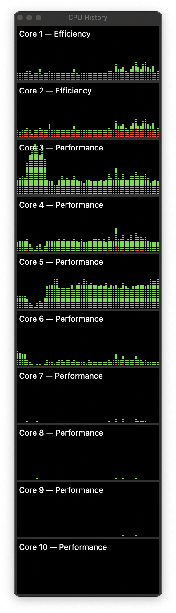

# Core Exercise
This simple Java program starts a series of Java system
threads that carry out system CPU-only calls of random duration.

## Why
My intent was to see if I could light up the Performance cores
of a late 2021 MacBook M1 Pro having two efficienty cores and eight
performance cores. The code is applicable to any kind of
machine running Java, however.

## Results
The code was able to light just four performance cores on my 16 GB M1 Pro. The
usually-active efficiency cores dropped lower than their normal
utilization, provided I quit interacting with the desktop. Note
that there is no direct console output from the app code.



## Run

Run the committed "production" classes from a terminal open on the 
project root:

```java
java -cp "./out/production/core-exercise" com.rogersalumni.Main
```
It displays a "starting" message and then appears to hang. Any core utilization display will 
start to alter itself. 

To end, use `ctrl+c`. There will be a delay while threads begin to understand that it's over.
